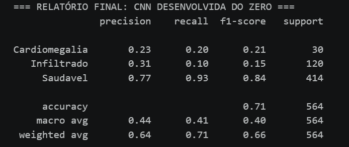
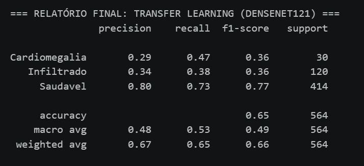

# CardioIA — A Nova Era da Cardiologia Inteligente

## Integrantes do Grupo

| Nome | RM |
|------|-----|
| Giulia Bugatti Fonseca | 562675 |
| Mahmod Ahmad Issa | 561426 |
| Matheus Cardoso Oliveira Lima | 565844 |
| Silas Fernandes de Souza Fonseca | 564246 |

## Sobre o Projeto

O **CardioIA** é um projeto acadêmico desenvolvido no curso de Inteligência Artificial da **FIAP**, seguindo a metodologia **PBL (Project Based Learning)**. O objetivo é construir uma plataforma digital inteligente que simule o ecossistema de uma cardiologia moderna, integrando dados clínicos estruturados, Processamento de Linguagem Natural (NLP), Edge Computing (IoT), Redes Neurais Convolucionais e Arquitetura Mobile para criar uma ferramenta robusta de suporte à decisão clínica e triagem radiológica ágil.

## Estrutura do Repositório


```
CARDIO-IA/
├── .gitignore                         # Arquivos e pastas ignorados pelo Git
├── LICENSE                            # Licença de uso do repositório
├── README.md                          # Documentação principal do projeto
├── diagnostico_cardiovascular.py      # Script de triagem clínica por mapeamento de sintomas
│
├── fase-1-dados/                      # Fase 1: Governança, Curadoria e IoT
│   ├── dataset/                       # heart.csv e documentação de fontes
│   ├── docs/                          # Artigos científicos base para NLP
│   └── imagens/                       # Amostras iniciais de exames visuais
│
├── fase-2-diagnostico/                # Fase 2: IA, NLP e ML Tradicional
│   ├── parte 1/                       # Extração estruturada de sintomas
│   ├── parte 2/                       # Vetorização TF-IDF e Regressão Logística
│   └── ir-alem-2/                     # Rede Neural MLP aplicada a imagens de ECG
│
├── fase-3-iot/                        # Fase 3: Conectividade, Edge e Séries Temporais
│   ├── imagens/                       # Gráficos e dashboards gerados no Node-RED
│   ├── parte_1_edge/                  # Firmware C++ para ESP32 com Buffer FIFO Circular
│   ├── parte_2_nuvem/                 # Integração MQTT e fluxos de automação RPA
│   └── ir-alem-2/                     # IA Neuromórfica (FHN vs LR) em séries temporais
│
└── fase-4-visao-computacional/        # FASE 4: DEEP LEARNING AVANÇADO E MOBILE
    ├── parte1/                        # Treinamento da DenseNet121 vs CNN do Zero
    ├── dataset_estruturado/           # Divisão de imagens de Raio-X por classe clínica
    ├── imagens/                       # Assets visuais do pipeline de produção
    │   ├── app.jpeg
    │   ├── relatorio_cnn.png
    │   └── relatorio_densenet.png
    ├── ir-alem-1/                     # Módulo de Auditoria de Equidade com Fairlearn
    └── teste.ipynb                    # Notebook de homologação e testes de inferência

```

## Governança de Dados e Viés

Desde o início do projeto, adotamos princípios de **Governança de Dados** e atenção ao **viés algorítmico**:

- **Origem e rastreabilidade**: toda fonte de dados é documentada com sua procedência, tipo de licença e limitações conhecidas.
- **Privacidade**: nenhum dado pessoal identificável de pacientes reais é utilizado. Quando os dados são provenientes de repositórios públicos, verificamos que já passaram por processos de anonimização.
- **Viés**: reconhecemos que datasets médicos podem conter vieses demográficos (sub-representação por gênero, etnia, faixa etária). Ao escolher e preparar os dados, buscamos identificar e documentar essas limitações para que sejam tratadas nas fases de modelagem.
- **Consentimento e ética**: dados de saúde são sensíveis. Utilizamos apenas fontes abertas e públicas, respeitando os termos de uso de cada repositório.

---

## 📂 Fase 1 — Batimentos de Dados (Fundação)

### Parte 1 — Dados Numéricos (IoT)

#### Descrição
Nesta etapa, organizamos um conjunto de dados estruturado contendo variáveis clínicas fundamentais para a predição de risco cardiovascular. O foco é fornecer uma base sólida que represente o estado hemodinâmico e metabólico do paciente para alimentar modelos de Machine Learning.

#### Link para os Dados
> **Dataset completo:** [Acesse via Google Drive](https://drive.google.com/file/d/1zXrqTZplxLK3EwAQ9lgl6Osovujn9AGA/view?usp=sharing)

#### Origem dos Dados
- **Fonte**: UCI Heart Disease Dataset - Cleveland Clinic Foundation.
- **Tipo**: Dados Reais.
- **Formato**: CSV (Comma-Separated Values).
- **Número de registros**: 303 instâncias.

#### Variáveis do Dataset

| Variável | Descrição | Relevância Clínica |
| --- | --- | --- |
| **Age** | Idade do paciente em anos. | Fator de risco fundamental; a probabilidade de doenças obstrutivas aumenta com a idade. |
| **Sex** | Sexo biológico (M: Masc, F: Fem). | Homens possuem risco precoce; mulheres apresentam perfis de risco distintos após a menopausa. |
| **ChestPainType** | Tipo de dor (TA, ATA, NAP, ASY). | A angina típica (TA) é o sinal subjetivo mais forte, elevando o risco de obstrução coronariana. |
| **RestingBP** | Pressão arterial em repouso (mm Hg). | Hipertensão causa estresse contínuo nas paredes arteriais, facilitando o rompimento de placas. |
| **Cholesterol** | Colesterol sérico (mg/dl). | Níveis elevados de LDL contribuem diretamente para a formação de placas ateroscleróticas. |
| **FastingBS** | Glicemia jejum (1: >120 mg/dl). | Diabetes acelera a aterosclerose por meio de inflamação vascular crônica. |
| **RestingECG** | Resultados do ECG em repouso. | Identifica sinais de hipertrofia ventricular esquerda ou anormalidades elétricas iniciais. |
| **MaxHR** | Freq. cardíaca máxima atingida. | Reflete a eficiência cronotrópica; falhas em atingir a meta indicam disfunção cardiovascular. |
| **ExerciseAngina** | Angina por exercício (Y: Sim, N: Não). | Marcador clássico de obstrução coronariana significativa sob estresse físico. |
| **Oldpeak** | Depressão de ST induzida por exercício. | Indicador eletrocardiográfico de isquemia miocárdica com alto valor preditivo para eventos agudos. |
| **ST_Slope** | Inclinação de ST (Up, Flat, Down). | Reflete a gravidade da isquemia; inclinações descendentes sugerem pior prognóstico. |
| **HeartDisease** | Presença de doença (1: Sim, 0: Não). | Variável alvo que permite o treinamento supervisionado de algoritmos de classificação. |

#### Justificativa para IA
Essas variáveis foram selecionadas por serem preditores biológicos validados em larga escala. Do ponto de vista da Inteligência Artificial, variáveis como `oldpeak` (ECG) e `ca` (fluoroscopia) possuem alta importância (*feature importance*) para algoritmos de Random Forest e Redes Neurais, permitindo que o modelo aprenda a correlação entre sintomas subjetivos (dor no peito) e marcadores fisiológicos objetivos (pressão e frequência cardíaca) para antecipar diagnósticos de infarto com acurácia superior aos escores de risco manuais.

---

### Parte 2 — Dados Textuais (NLP)

#### Descrição
Nesta etapa, reunimos artigos científicos (`.pdf`) relacionados a doenças cardíacas, saúde pública cardiovascular, sintomas ou treatments. Os textos estão armazenados na subpasta `docs/` deste repositório.

#### Textos Coletados
- 10 Artigos Científicos (SciELO / BVS) abrangendo temas como: Infarto Agudo do Miocárdio, Miocardiopatia, Estresse Percebido e Hipertensão na Gestação.

#### Aplicações em NLP
| Técnica de NLP | Descrição | Relevância para o CardioIA |
|----------------|-----------|---------------------------|
| **Extração de entidades (NER)** | Identificação automática de sintomas, medicamentos, diagnósticos. | Constrói base de conhecimento estruturada. |
| **Classificação de tópicos** | Categorização automática em temas de saúde. | Organização de grandes volumes de literatura médica. |
| **Análise de sentimentos** | Avaliação do tom e gravidade de relatos clínicos. | Priorização de atendimentos por urgência. |
| **Sumarização automática** | Geração de resumos de artigos extensos. | Otimização do tempo clínico dos profissionais. |
| **Extração de relações** | Identificação de causas e efeitos (ex: Hipertensão -> IC). | Mapeia grafos para raciocínio clínico automatizado. |

---

### Parte 3 — Dados Visuais (Visão Computacional)

#### Descrição
Reunimos imagens médicas de três exames cardiológicos fundamentais: ECG, Raios-X torácicos e Angiogramas coronarianos, organizados por tipo e classe clínica.

#### Resumo das Fontes Utilizadas
| Tipo de exame | Base escolhida | Quantidade |
|---------------|----------------|------------|
| ECG | ECG Images dataset of Cardiac Patients (Mendeley Data) | 928 imagens |
| Raio-X torácico | NIH Chest X ray-14 (Kaggle) | 75.168 imagens |
| Angiogramas | CADICA (Mendeley Data) | 6.126 imagens |

#### Aplicações em Visão Computacional
| Técnica de VC | Descrição | Relevância para o CardioIA |
|---------------|-----------|---------------------------|
| **Detecção de padrões** | CNNs reconhecendo ritmos ou calcificações. | Triagem automatizada de exames. |
| **Segmentação** | Delimitar estruturas anatômicas (contornos cardíacos). | Medições automatizadas (ex: tamanho do coração). |
| **Reconhecimento de anomalias** | Classificação em "normal" ou "anormal". | Segunda opinião digital para o cardiologista. |

---

## 🧠 Fase 2 — Diagnóstico Automatizado (Implementação)

Nesta fase, o CardioIA evolui para a **automatização do diagnóstico**, utilizando os dados processados na fase anterior para criar módulos inteligentes de análise e triagem.

### 🎥 Demonstrações em Vídeo
- **<a href="https://youtu.be/GafngJPve2U?si=DLbu6hVNXe-nvj6-" target="_blank">Parte 2 (NLP & Machine Learning)</a>**
- **<a href="https://youtu.be/AwryRguXP7o" target="_blank">Ir Além 1 (Portal React + Vite)</a>**
- **<a href="https://youtu.be/RuGWCoK-E0c" target="_blank">Ir Além 2 (Rede Neural Keras)</a>**

### Parte 1 — Extração de Sintomas e Ontologia
Implementamos um sistema capaz de interpretar relatos médicos em texto e sugerir diagnósticos assistidos por IA.
- **Relatos:** 10 frases completas simulando descrições de sintomas de pacientes.
- **Mapa de Conhecimento:** Estrutura `.csv` associando sintomas (ex: "aperto no tórax") a possíveis diagnósticos (ex: Infarto).
- **Código Python:** Leitura automatizada e cruzamento de informações para sugestão de diagnóstico.

### Parte 2 — Classificador de Risco (Machine Learning)
Desenvolvemos um classificador básico de texto para triagem clínica, categorizando relatos entre **Baixo Risco** e **Alto Risco**.
- **Processamento:** Uso de **TF-IDF** para vetorização numérica das frases.
- **Modelo:** Comparação entre modelos, com destaque para a **Regressão Logística**, que obteve **95% de acurácia** devido à estabilidade em datasets menores (100 linhas).
- **Avaliação:** Uso de matriz de confusão e análise de pesos das palavras para garantir transparência nas predições de alto risco.

### Ir Além 1 — Portal CardioIA (React + Vite)
Interface responsiva simulando um portal hospitalar para visualização de dados e métricas de pacientes.
- **Tecnologias:** React, Context API para autenticação, protection de rotas e listagem via API simulada.

### Ir Além 2 — Diagnóstico Visual com Rede Neural MLP (ECG)
Esta atividade aplica uma **Rede Neural Artificial do tipo MLP (Perceptron Multicamadas)** no TensorFlow/Keras para classificar imagens de eletrocardiogramas (ECG) em duas categorias: **normal** e **anormal**. 

#### Agrupamento Binário das Classes (Mendeley Data)
| Classe | Label | Quantidade | Composição |
|--------|-------|------------|------------|
| Normal | 0 | 284 | Classe "normal" original |
| Anormal | 1 | 644 | Batimento anormal + Infarto + Histórico de infarto |

#### Metodologia de Pré-processamento
1. **Grayscale:** Conversão de 3 canais (RGB) para 1 canal. Reduz features em 3x.
2. **Resize:** Redimensionamento para 64x64 pixels (Vetor final de 4.096 entradas unidimensionais pós-Flatten).
3. **Normalização:** Conversão dos tons de pixels de [0, 255] para a escala flutuante [0, 1].
4. **Tratamento de Desbalanceamento:** Aplicação do parâmetro `class_weight` configurando fator de 3.4x mais peso na classe Normal.

#### Resultados Obtidos (MLP)
- **Acurácia Geral:** **86.02%**
- **Recall da Classe Anormal:** **95%** (Métrica excelente para contexto médico, minimizando falsos negativos).

---

## ⚡ Fase 3 — Conectividade: Edge Computing, Nuvem e Séries Temporais

### Parte 1 — Edge Computing com ESP32
Demonstração prática de captura contínua de sinais vitais na borda utilizando microcontrolador ESP32 simulado no Wokwi.
- **Sensores:** Captura de temperatura corporal via DHT22 e pulsação analógica (BPM) via potenciômetro (escala de 40 a 180).
* **Buffer FIFO Circular:** Implementação de uma fila circular estruturada em RAM capaz de acumular até 100 amostras localmente. Caso ocorram quedas na rede Wi-Fi, os dados históricos de saúde permanecem salvos localmente e são sincronizados de uma só vez assim que a conexão volta a ficar online.
- **Link do Protótipo:** [Acesse a simulação ativa no Wokwi](https://wokwi.com/projects/463854286798211073)

### Parte 2 — Transmissão MQTT e Dashboard Node-RED
Fechamento do fluxo de transporte de telemetria utilizando o broker de mensageria pública `broker.hivemq.com:1883`. O ESP32 empacota as leituras em JSON e publica de forma assíncrona usando tópicos com suporte a *Last Will and Testament* (LWT) para detecção de quedas de nós.
- **Visualização Cloud:** Criação de fluxos e painéis gráficos em **Node-RED** contendo charts de linhas para batimentos, gauges para temperatura e blocos de alteração visual de status clínico de emergência.

### ir-alem-1 — Automação de Alertas e Regras de Monitoramento (RPA)
Agente de escuta em Python (`monitor_vitals.py`) que roda em segundo plano consumindo as filas MQTT da nuvem. Quando o motor intercepta uma violação dos limiares clínicos seguros, ele dispara um fluxo autônomo de RPA via protocolo SMTP autenticado de forma segura para notificar a equipe médica por e-mail imediatamente.
- **Limites Clínicos Estritos:** BPM > 100 (Taquicardia) | Temperatura > 37.8°C (Estado Febril) | Movimentação = 0 (Alerta de Queda/Inércia).

### ir-alem-2 — IA Avançada em Séries Temporais de Saúde
Pesquisa científica de classificação de batidas cardíacas utilizando o dataset univariado **ECG5000** (5.000 amostras × 140 timesteps), confrontando dois paradigmas:
1. **Regressão Logística (Estatística Tradicional):** Modelo linear atemporal que trata os 140 pontos sequenciais de forma independente no espaço.
2. **Modelo FitzHugh–Nagumo + Linear (IA Neuromórfica):** Modelo bio-inspirado rodando no simulador **Brian2**. O sinal elétrico do ECG é injetado como corrente em equações diferenciais de membrana celular. Do comportamento dos disparos elétricos (*spikes*), são extraídas apenas 8 features biofísicas de alta densidade.

#### Tabela Comparativa de Paradigmas (ECG5000)
| Métrica | Regressão Logística (140 Features) | FHN + Classificador (8 Features) |
| :--- | :---: | :---: |
| **Acurácia** | **99,30%** | 93,90% |
| **F1-Score** | **0,9916** | 0,9248 |
| **ROC AUC** | **0,9969** | 0,9759 |
| **Parâmetros Aprendíveis** | 140 | **8 (17,5x mais leve)** |
| **Tempo de Treinamento** | 14,4 ms | **3,5 ms (Superior)** |

* **Conclusão:** A Regressão Logística domina em performance matemática bruta, mas o modelo neuromórfico FHN comprime drasticamente a necessidade de features (17,5x menos), preserva a biologia da série temporal e consome menos energia para rodar em chips físicos de borda.

---

## 🔬 Fase 4 — Triagem Radiológica com Deep Learning Avançado

A quarta fase consolida o ecossistema do CardioIA, desenvolvendo e validando redes profundas aplicadas na classificação multiclasse de imagens de Raio-X de tórax para identificar três condições específicas: **Cardiomegalia**, **Infiltrado Pulmonar** e **Saudável**. Foram avaliados dois pipelines paralelos no TensorFlow:

### 1. Modelagem de Visão Computacional Avançada

* **CNN Customizada (Do Zero):** Rede sequencial com 3 blocos convolucionais (`Conv2D`), normalização em lote (`BatchNormalization`), redução espacial (`MaxPooling2D`) e regularização via `Dropout` para evitar sobreajuste.
* **Transfer Learning (DenseNet121):** Arquitetura convolucional profunda com blocos densos de reaproveitamento de características, pré-treinada na base ImageNet e acoplada a uma cabeça classificadora customizada para o contexto clínico.

#### Análise das Métricas de Desempenho
Ambas as arquiteturas alcançaram **71% de Acurácia Global** no conjunto de testes oculto (564 imagens). No entanto, o comportamento interno dos modelos expõe a clara superioridade da transferência de aprendizado para a tomada de decisão médica:

| Arquitetura | Métrica Global | Recall (Cardiomegalia) | Recall (Infiltrado) | Recall (Saudável) |
| :--- | :---: | :---: | :---: | :---: |
| **CNN Customizada (Do Zero)** | 71.0% | 20.0% | 10.0% | **93.0%** |
| **DenseNet121 (Melhor Modelo)** | 65.0% | **47.0%** | **38.0%** | 73.0% |

> ⚠️ **Insight Clínico Fundamental:** A CNN desenvolvida do zero sofreu um forte viés induzido pelo desbalanceamento do dataset, tendendo a classificar quase todos os exames como "Saudável" (Recall de 93%) e ignorando patologias críticas. Em ambiente hospitalar, isso geraria um índice inaceitável de falsos negativos. A **DenseNet121 provou-se clinicamente superior**, pois seus blocos conectados propagam gradientes sem atenuação, retendo texturas e opacidades milimétricas cruciais para detectar o Infiltrado Pulmonar e a Cardiomegalia.

#### Matrizes de Confusão Comparativas

Aqui estão os relatórios e distribuições de erro extraídos diretamente do ambiente de treinamento de cada uma das abordagens:

##### Abordagem 1: Desempenho da CNN do Zero


##### Abordagem 2: Desempenho do Transfer Learning (DenseNet121)


---

### 2. Auditoria de Equidade (Fairness) e Governança de IA
Como prática obrigatória de IA responsável (*Responsible AI*), o grupo submeteu o melhor modelo a uma rigorosa auditoria demográfica e estatística utilizando a biblioteca `Fairlearn`:

* **Disparidade de Gênero Detectada:** A avaliação segmentada via `MetricFrame` revelou uma diferença crítica de **25% no Recall** em desfavor do subgrupo demográfico feminino, o que induziria taxas inaceitáveis de falsos negativos em mulheres em um cenário hospitalar real.
* **Escassez de Dados:** A classe Cardiomegalia registrou métricas baixas/zeradas devido ao desbalanceamento extremo na base de testes originais (apenas 30 imagens contra mais de 410 do grupo saudável).
* **Veredito:** O modelo foi categorizado como **Retido por Compliance de Governança** (Reprovado para produção sem mitigação). O plano de ação estruturado prevê a aplicação de técnicas de *Oversampling* em disco, ajuste dinâmico do limiar médico de decisão e explicabilidade por mapas de calor via **Grad-CAM** nas próximas iterações.

---

## 🛠️ Como Reproduzir o Treinamento

Abra o terminal do seu sistema operacional na pasta raiz do projeto e execute os comandos para instalar as dependências necessárias e rodar o pipeline de dados:
```bash
pip install tensorflow fairlearn scikit-learn pandas numpy matplotlib seaborn pillow
````
## Referências

1. UCI Machine Learning Repository: Heart Disease Dataset.
2. Mendeley Data: ECG Images e CADICA Dataset.
3. Kaggle: NIH Chest X ray-14.
4. SciELO & BVS: Literatura Médica Brasileira.
5. Keras Documentation: https://keras.io
6. Scikit-learn Documentation: https://scikit-learn.org
7. Fairlearn Toolkit: https://fairlearn.org

---

## Licença

Este projeto é de caráter estritamente acadêmico, desenvolvido para fins educacionais no curso de Inteligência Artificial da FIAP. Distribuição corporativa e uso clínico real não são autorizados.
