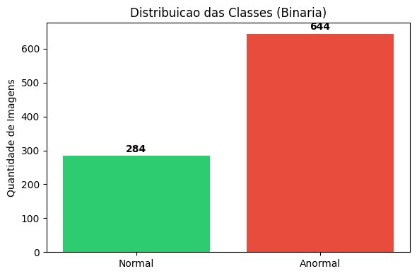
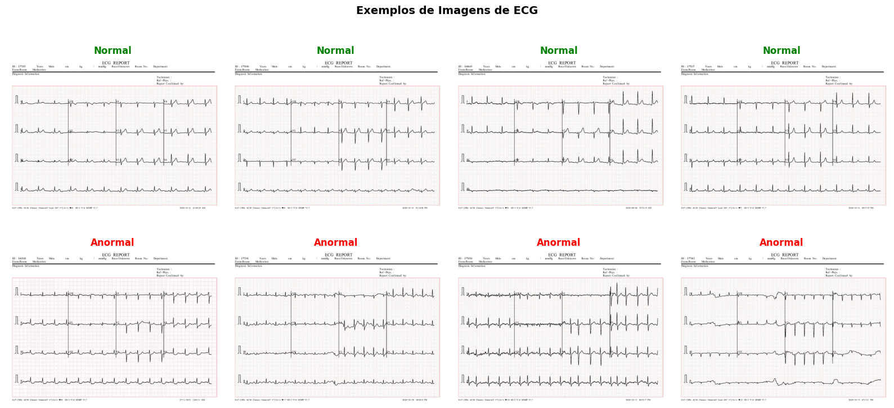
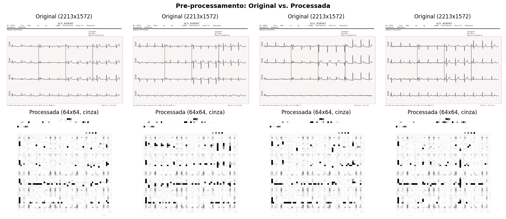
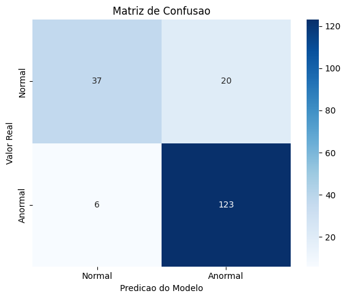
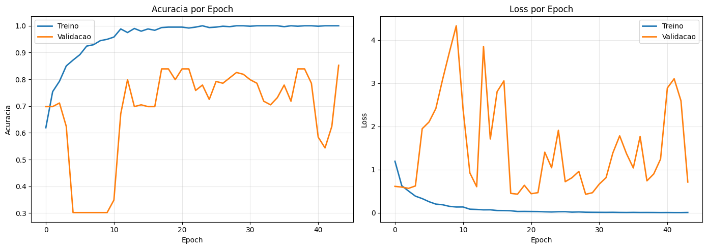

# Ir Alem 2 -- Diagnostico Visual em Cardiologia com Rede Neural

## Sobre a Atividade

Esta atividade aplica uma **Rede Neural Artificial do tipo MLP (Perceptron Multicamadas)** para classificar imagens de eletrocardiogramas (ECG) em duas categorias: **normal** e **anormal**. O objetivo e demonstrar como a Inteligencia Artificial pode auxiliar na triagem automatizada de pacientes cardiologicos por meio de diagnostico visual.

---

## Dataset Utilizado

- **Fonte:** ECG Images dataset of Cardiac Patients -- Mendeley Data
- **Link:** https://data.mendeley.com/datasets/gwbz3fsgp8/2
- **Licenca:** CC BY 4.0
- **Total:** 928 imagens JPG (2213x1572 pixels, coloridas)

### Classes Originais

| Classe | Quantidade |
|--------|------------|
| Normal | 284 |
| Batimento cardiaco anormal | 233 |
| Infarto do miocardio | 239 |
| Historico de infarto do miocardio | 172 |

### Agrupamento Binario

Para a classificacao binaria exigida pela atividade, as classes foram reorganizadas:

| Classe | Label | Quantidade | Composicao |
|--------|-------|------------|------------|
| Normal | 0 | 284 | Classe "normal" original |
| Anormal | 1 | 644 | Batimento anormal + Infarto + Historico de infarto |



---

## Estrutura de Pastas

```
cardio-ia-fase-2-parte-1/
├── docs/
│   └── imagens/
│       └── ecg/
│           └── train/
│               ├── normal/                              # 284 imagens
│               ├── batimento cardiaco anormal/           # 233 imagens
│               ├── infarto do miocardio/                 # 239 imagens
│               └── historico de infarto do miocardio/    # 172 imagens
│
├── ir_alem_2/
│   ├── IR_ALEM_2.md                                     # Este arquivo
│   ├── ecg_diagnostico_visual.ipynb                     # Notebook com o codigo completo
│   └── imagens/                                         # Graficos e resultados visuais
│       ├── distribuicao_classes.png
│       ├── exemplos_ecg.png
│       ├── preprocessamento.png
│       ├── matriz_confusao.png
│       └── curvas_aprendizado.png
│
└── README.md
```

---

## Metodologia

### 1. Exemplos de Imagens do Dataset

Abaixo, exemplos reais de ECGs do dataset utilizado. A linha superior mostra ECGs normais e a inferior mostra ECGs anormais:



### 2. Pre-processamento das Imagens

As imagens originais (2213x1572, RGB) passam por quatro transformacoes antes de alimentar a rede neural:

| Etapa | Transformacao | Justificativa |
|-------|---------------|---------------|
| Grayscale | 3 canais (RGB) para 1 canal | A informacao diagnostica do ECG esta na forma da onda, nao nas cores. Reduz features em 3x |
| Resize | 64x64 pixels | Reduz dimensionalidade para 4.096 pixels. Tamanho escolhido para manter uma relacao saudavel entre features e amostras |
| Flatten | Matriz 64x64 para vetor de 4.096 | MLP exige entrada unidimensional (diferente de CNNs que aceitam matrizes) |
| Normalizacao | Pixels de [0, 255] para [0, 1] | Estabiliza o treinamento e acelera a convergencia do otimizador |

O resultado visual do pre-processamento:



### 3. Divisao dos Dados

- **80% para treino** (742 imagens)
- **20% para teste** (186 imagens)
- Divisao **estratificada** para manter a proporcao normal/anormal em ambos os conjuntos

### 4. Tratamento do Desbalanceamento

O dataset possui ~30% Normal vs ~70% Anormal. Sem tratamento, o modelo tende a classificar tudo como a classe majoritaria (Anormal). Para resolver isso, utilizamos **class_weight** com fator 3.4x mais peso na classe Normal, forcando o modelo a penalizar mais os erros na classe minoritaria.

### 5. Arquitetura da Rede Neural (MLP)

```
Camada de Entrada: 4.096 neuronios (imagem achatada)
        |
Dense(256, ativacao='relu')
BatchNormalization()
Dropout(0.3)
        |
Dense(128, ativacao='relu')
BatchNormalization()
Dropout(0.3)
        |
Dense(64, ativacao='relu')
Dropout(0.2)
        |
Dense(1, ativacao='sigmoid')  -->  Saida: probabilidade [0, 1]
```

**Resumo do modelo (Keras):**

| Camada | Output Shape | Parametros |
|--------|-------------|------------|
| Dense (256, ReLU) | (None, 256) | 1.048.832 |
| BatchNormalization | (None, 256) | 1.024 |
| Dropout (0.3) | (None, 256) | 0 |
| Dense (128, ReLU) | (None, 128) | 32.896 |
| BatchNormalization | (None, 128) | 512 |
| Dropout (0.3) | (None, 128) | 0 |
| Dense (64, ReLU) | (None, 64) | 8.256 |
| Dropout (0.2) | (None, 64) | 0 |
| Dense (1, Sigmoid) | (None, 1) | 65 |
| **Total** | | **1.091.585** |

**Decisoes de arquitetura:**

- **ReLU (Rectified Linear Unit):** funcao de ativacao que resolve o problema do vanishing gradient e permite treinamento mais rapido que sigmoid/tanh nas camadas ocultas
- **BatchNormalization:** normaliza as ativacoes entre camadas, estabilizando e acelerando o treinamento
- **Dropout (20-30%):** tecnica de regularizacao que "desliga" neuronios aleatoriamente durante o treino -- essencial com dataset pequeno (928 imagens) para evitar overfitting
- **Sigmoid na saida:** retorna um valor entre 0 e 1, interpretado como probabilidade de ser "anormal"
- **Rede compacta (256-128-64):** arquitetura dimensionada para o tamanho do dataset, evitando excesso de parametros

### 6. Treinamento

| Parametro | Valor | Justificativa |
|-----------|-------|---------------|
| Otimizador | Adam (lr=0.0003) | Taxa de aprendizado reduzida para convergencia mais estavel com dataset pequeno |
| Funcao de perda | Binary Crossentropy | Padrao para classificacao binaria |
| Metrica | Accuracy | Exigida pelo enunciado |
| Epochs | 150 (max) | Limite superior, controlado pelo EarlyStopping |
| Batch size | 16 | Batches menores para melhor generalizacao com poucas amostras |
| EarlyStopping | patience=15 | Para o treinamento se a val_loss nao melhorar por 15 epochs consecutivas |
| Class weight | Normal: 2.45, Anormal: 0.72 | Compensa o desbalanceamento entre as classes |

O treinamento finalizou automaticamente na **epoch 44** (de 150 possiveis), pois o EarlyStopping detectou que a val_loss parou de melhorar.

---

## Resultados Obtidos

### Acuracia

| Metrica | Valor |
|---------|-------|
| **Acuracia geral** | **86.02%** |
| Loss no teste | 0.3555 |

### Relatorio de Classificacao

| Classe | Precision | Recall | F1-Score | Amostras |
|--------|-----------|--------|----------|----------|
| Normal | 0.86 | 0.65 | 0.74 | 57 |
| Anormal | 0.86 | 0.95 | 0.90 | 129 |
| **Macro avg** | **0.86** | **0.80** | **0.82** | **186** |

O modelo identifica **95% dos casos anormais** (alto recall), o que e desejavel em contexto medico -- minimiza o risco de liberar pacientes com condicoes cardiacas nao detectadas.

### Matriz de Confusao



### Curvas de Aprendizado

Os graficos abaixo mostram a evolucao da acuracia e da loss ao longo das epochs de treinamento. A comparacao entre treino e validacao permite identificar se houve overfitting.



---

## Tecnologias Utilizadas

| Biblioteca | Versao | Uso |
|------------|--------|-----|
| TensorFlow / Keras | 2.x | Construcao, compilacao e treinamento da MLP |
| OpenCV (cv2) | 4.x | Carregamento, redimensionamento e conversao de imagens |
| scikit-learn | 1.x | Split treino/teste, class_weight, metricas de avaliacao |
| NumPy | 2.x | Manipulacao de arrays e vetores |
| Matplotlib / Seaborn | - | Graficos e visualizacoes |

---

## Limitacoes e Proximos Passos

- **MLP vs CNN**: a MLP trata cada pixel como feature independente, perdendo informacoes espaciais. Uma CNN seria mais adequada para visao computacional, pois preserva relacoes entre pixels vizinhos.
- **Dataset pequeno**: 928 imagens e um volume reduzido para deep learning. Data augmentation poderia expandir artificialmente o dataset.
- **Desbalanceamento**: utilizamos class_weight para mitigar o vies para a classe majoritaria. Oversampling (SMOTE) poderia complementar.

---

## Como Executar

1. Certifique-se de ter Python 3.8+ instalado
2. Instale as dependencias:
   ```bash
   pip install tensorflow opencv-python scikit-learn matplotlib seaborn numpy
   ```
3. Abra o notebook:
   ```bash
   jupyter notebook ir_alem_2/ecg_diagnostico_visual.ipynb
   ```
4. Execute todas as celulas sequencialmente

---

## Referencias

- ECG Images dataset of Cardiac Patients -- Mendeley Data: https://data.mendeley.com/datasets/gwbz3fsgp8/2
- Keras Documentation: https://keras.io
- Scikit-learn Documentation: https://scikit-learn.org
